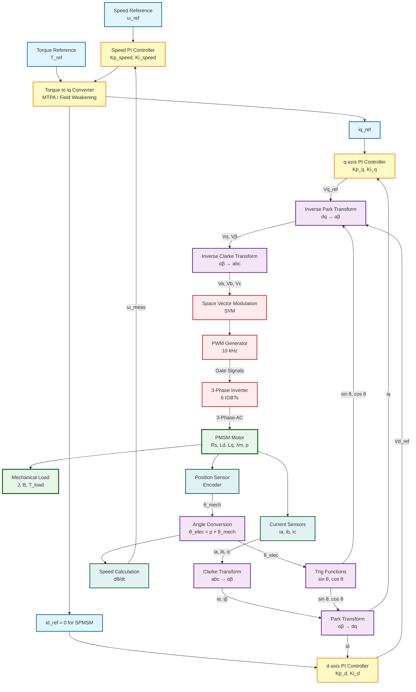
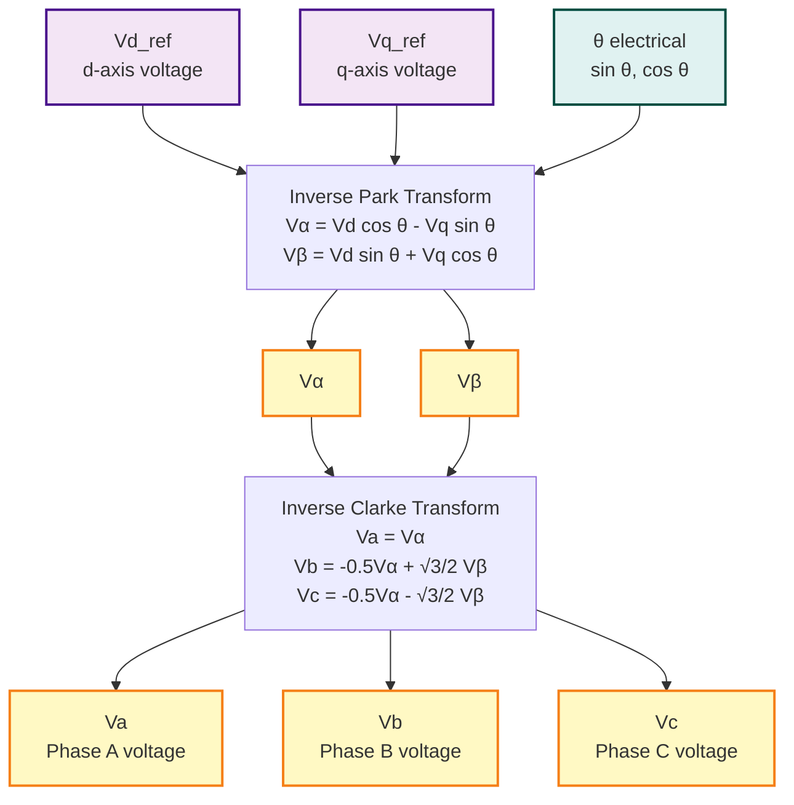
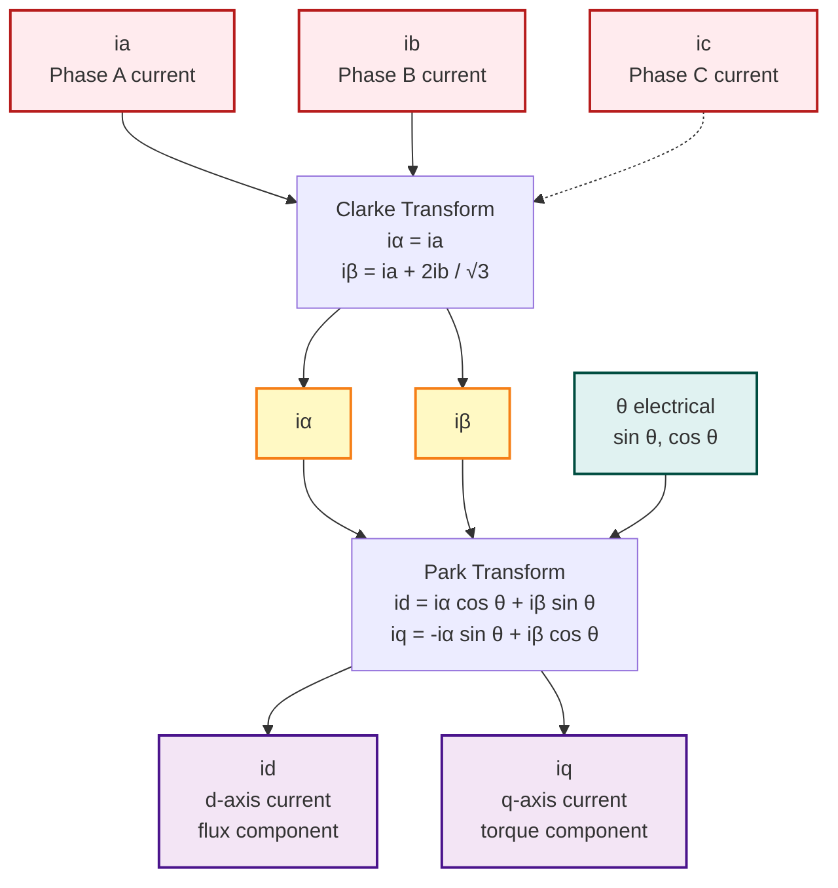
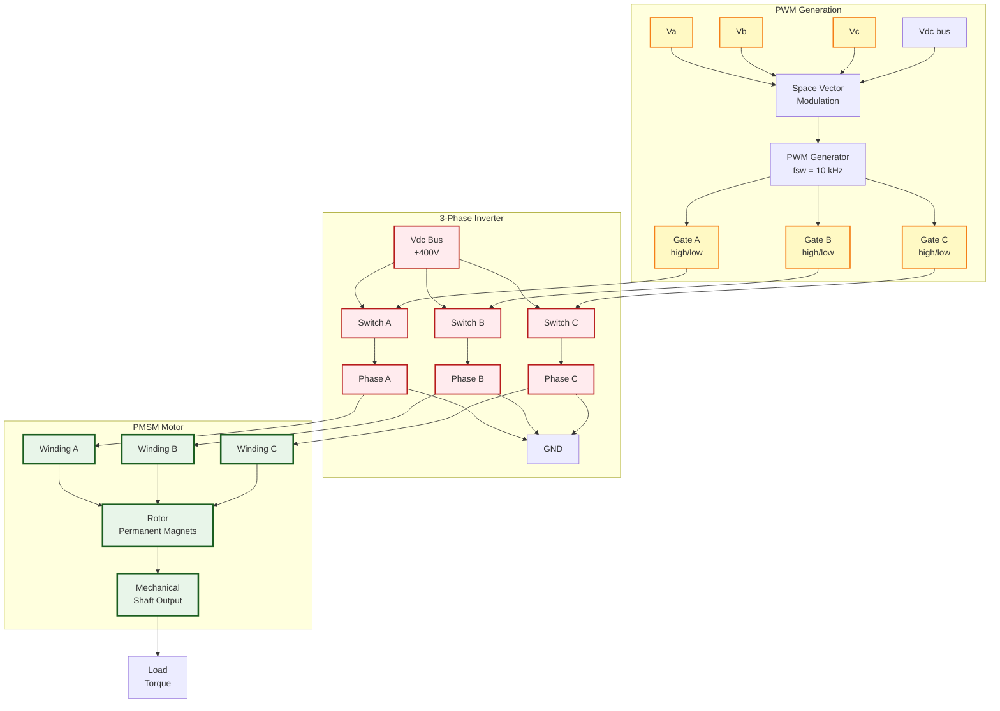
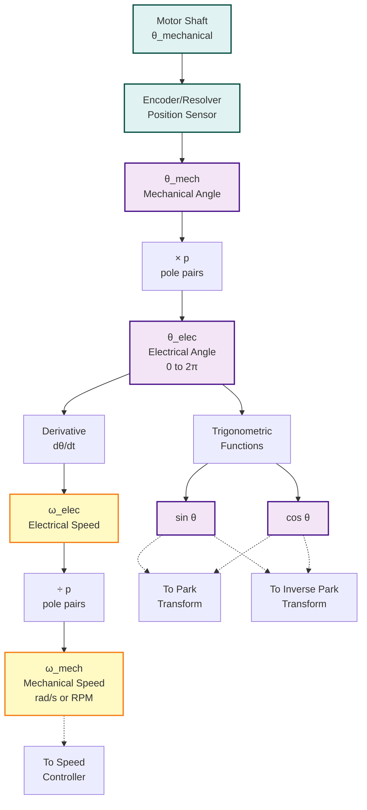
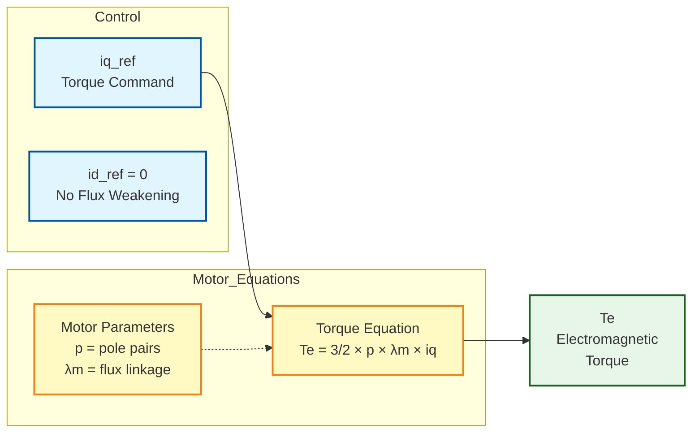
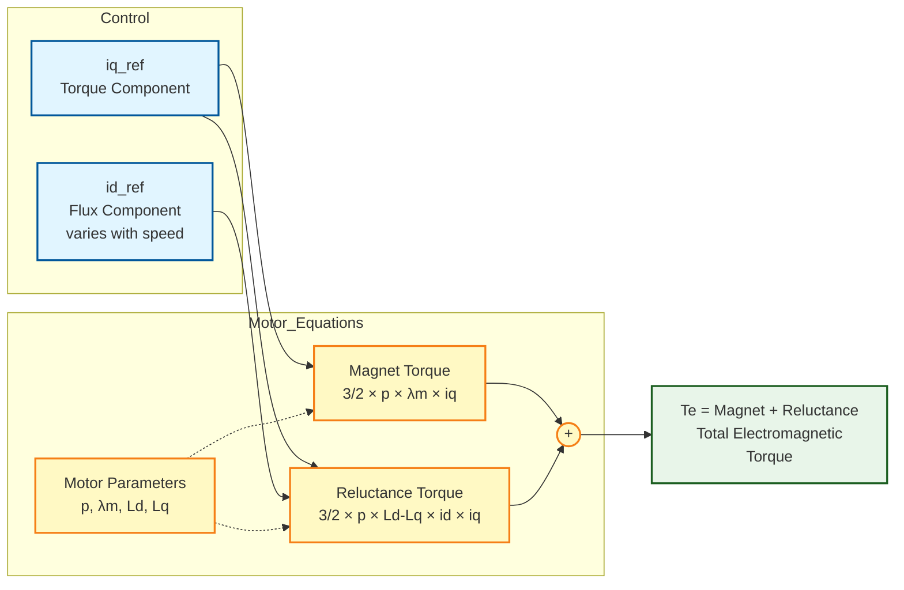
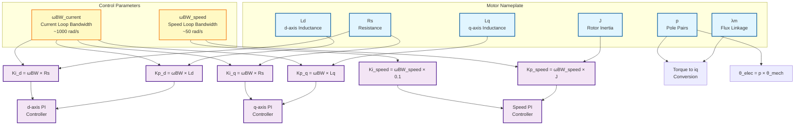
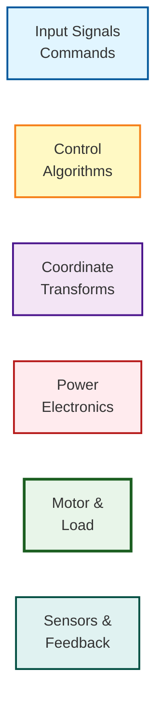

# FOC System - Visual Mermaid Diagrams

This file contains interactive Mermaid diagrams for the FOC control system. View this in VS Code or any Mermaid-compatible viewer.

---

## 📊 COMPLETE FOC SYSTEM - HIGH LEVEL



---

## 🔄 DETAILED CONTROL LOOPS

### Speed Control Loop (Outer Loop)

```mermaid
flowchart LR
    SpeedRef[ω_ref<br/>Speed Reference] --> Sum1((+))
    Sum1 --> PI[PI Controller<br/>Kp_speed<br/>Ki_speed]
    PI --> TorqueRef[T_ref<br/>Torque Command]
    SpeedMeas[ω_measured<br/>from motor] --> Neg((-))
    Neg --> Sum1
    
    classDef inputClass fill:#e1f5ff,stroke:#01579b,stroke-width:2px
    classDef controlClass fill:#fff9c4,stroke:#f57f17,stroke-width:2px
    classDef feedbackClass fill:#e0f2f1,stroke:#004d40,stroke-width:2px
    
    class SpeedRef,TorqueRef inputClass
    class PI controlClass
    class SpeedMeas,Neg feedbackClass
```

### Current Control Loop (Inner Loop - d-axis)

```mermaid
flowchart LR
    idRef[id_ref<br/>usually 0] --> Sum1((+))
    Sum1 --> PI[d-axis PI<br/>Kp_d = ωBW × Ld<br/>Ki_d = ωBW × Rs]
    PI --> Vd[Vd_ref<br/>d-axis Voltage]
    idMeas[id_measured<br/>from Park] --> Neg((-))
    Neg --> Sum1
    
    classDef inputClass fill:#e1f5ff,stroke:#01579b,stroke-width:2px
    classDef controlClass fill:#fff9c4,stroke:#f57f17,stroke-width:2px
    classDef feedbackClass fill:#e0f2f1,stroke:#004d40,stroke-width:2px
    
    class idRef,Vd inputClass
    class PI controlClass
    class idMeas,Neg feedbackClass
```

### Current Control Loop (Inner Loop - q-axis)

```mermaid
flowchart LR
    iqRef[iq_ref<br/>from torque] --> Sum1((+))
    Sum1 --> PI[q-axis PI<br/>Kp_q = ωBW × Lq<br/>Ki_q = ωBW × Rs]
    PI --> Vq[Vq_ref<br/>q-axis Voltage]
    iqMeas[iq_measured<br/>from Park] --> Neg((-))
    Neg --> Sum1
    
    classDef inputClass fill:#e1f5ff,stroke:#01579b,stroke-width:2px
    classDef controlClass fill:#fff9c4,stroke:#f57f17,stroke-width:2px
    classDef feedbackClass fill:#e0f2f1,stroke:#004d40,stroke-width:2px
    
    class iqRef,Vq inputClass
    class PI controlClass
    class iqMeas,Neg feedbackClass
```

---

## 🔀 COORDINATE TRANSFORMATIONS

### Forward Path: dq → abc



### Feedback Path: abc → dq



---

## ⚡ POWER STAGE

### Inverter and Motor



---

## 📐 POSITION & SPEED SENSING



---

## 🎯 TORQUE GENERATION (Motor Physics)

### SPMSM (Surface Mounted)



### IPMSM (Interior Mounted with Reluctance)



---

## 🔧 PARAMETER FLOW



---

## 📊 COMPLETE SYSTEM STATE FLOW

```mermaid
stateDiagram-v2
    [*] --> Initialization
    
    Initialization --> CurrentSensing : System Start
    
    state CurrentSensing {
        [*] --> MeasureABC
        MeasureABC --> ClarkeTransform
        ClarkeTransform --> ParkTransform
        ParkTransform --> [*]
    }
    
    CurrentSensing --> PositionSensing
    
    state PositionSensing {
        [*] --> ReadEncoder
        ReadEncoder --> ConvertAngle
        ConvertAngle --> CalcSpeed
        CalcSpeed --> ComputeTrig
        ComputeTrig --> [*]
    }
    
    PositionSensing --> Control
    
    state Control {
        [*] --> SpeedLoop
        SpeedLoop --> TorqueReference
        TorqueReference --> CurrentReferences
        CurrentReferences --> dqControllers
        dqControllers --> [*]
    }
    
    Control --> VoltageGeneration
    
    state VoltageGeneration {
        [*] --> InversePark
        InversePark --> InverseClarke
        InverseClarke --> SVM
        SVM --> PWMGeneration
        PWMGeneration --> [*]
    }
    
    VoltageGeneration --> MotorDrive
    
    state MotorDrive {
        [*] --> InverterSwitching
        InverterSwitching --> MotorExcitation
        MotorExcitation --> TorqueProduction
        TorqueProduction --> MechanicalOutput
        MechanicalOutput --> [*]
    }
    
    MotorDrive --> CurrentSensing : Feedback Loop (100μs)
    MotorDrive --> PositionSensing : Feedback Loop
```



---

## 🎨 LEGEND



---

## 📝 How to View These Diagrams

### In VS Code:
1. Install **Markdown Preview Mermaid Support** extension
2. Right-click this file → "Open Preview"
3. Diagrams will render automatically

### In GitHub:
- Mermaid is natively supported - just view the markdown file

### Export Options:
- VS Code: Export preview to HTML/PDF
- Online: Copy diagram code to https://mermaid.live
- Or use the accompanying HTML file for interactive view

---

## 🔗 Cross-Reference

- **Theory**: See [06_FOC_practical_guide.md](06_FOC_practical_guide.md) for detailed explanations
- **Connections**: See [FOC_Connections_Diagram.md](FOC_Connections_Diagram.md) for text-based connection details
- **Interactive**: See [FOC_Interactive_Diagram.html](FOC_Interactive_Diagram.html) for web-based visualization
